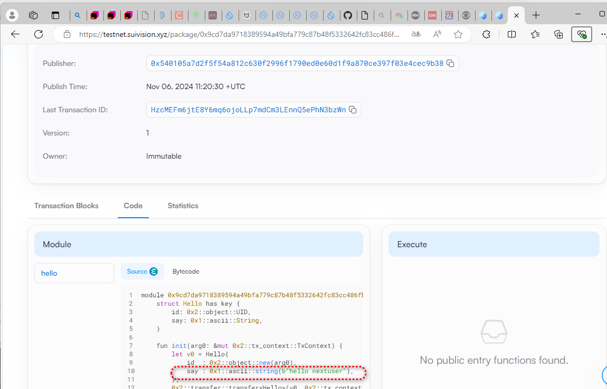

## 编译

```bash
sui move build
```
## 获取当前环境 
```shell
ljl@ljl-i5-14400:~/work/sui/move-cn/letsmove/mover/nextuser/code/task1/hello_move$ sui client envs
╭─────────┬─────────────────────────────────────┬────────╮
│ alias   │ url                                 │ active │
├─────────┼─────────────────────────────────────┼────────┤
│ testnet │ https://fullnode.testnet.sui.io:443 │ *      │
│ devnet  │ https://fullnode.devnet.sui.io:443  │        │
│ local   │ http://127.0.0.1:9000               │        │
│ mainnet │ https://fullnode.mainnet.sui.io:443 │        │
╰─────────┴─────────────────────────────────────┴────────╯

```
##  获取sui faucet
```bash
sui client switch --env testnet
sui client faucet

```
### 查看余额
```shell
sui client gas
```
## publish
```bash
sui client publish 
```

### publish 成功
```sui shell
ljl@ljl-i5-14400:~/work/sui/move-cn/letsmove/mover/nextuser/code/task1/hello_move$ sui client publish
UPDATING GIT DEPENDENCY https://gitee.com/MystenLabs/sui.git
INCLUDING DEPENDENCY Sui
INCLUDING DEPENDENCY MoveStdlib
BUILDING hello_move
Successfully verified dependencies on-chain against source.
Transaction Digest: HzcMEFm6jtE8Y6mq6ojoLLp7mdCm3LEnnQ5ePhN3bzWn
╭──────────────────────────────────────────────────────────────────────────────────────────────────────────────╮
│ Transaction Data                                                                                             │
├──────────────────────────────────────────────────────────────────────────────────────────────────────────────┤
│ Sender: 0x540105a7d2f5f54a812c630f2996f1790ed0e60d1f9a870ce397f03e4cec9b38                                   │
│ Gas Owner: 0x540105a7d2f5f54a812c630f2996f1790ed0e60d1f9a870ce397f03e4cec9b38                                │
│ Gas Budget: 10922400 MIST                                                                                    │
│ Gas Price: 1000 MIST                                                                                         │
│ Gas Payment:                                                                                                 │
│  ┌──                                                                                                         │
│  │ ID: 0x761035a215b60f6d3c08dff837b85a67f1e2620ba63a0904785924d37095c201                                    │
│  │ Version: 206232471                                                                                        │
│  │ Digest: B4nTVgM1jQ2gCi5VMzWRShMUwxf8Vc3q1Fc72mM45hp9                                                      │
│  └──                                                                                                         │
│                                                                                                              │
│ Transaction Kind: Programmable                                                                               │
│ ╭──────────────────────────────────────────────────────────────────────────────────────────────────────────╮ │
│ │ Input Objects                                                                                            │ │
│ ├──────────────────────────────────────────────────────────────────────────────────────────────────────────┤ │
│ │ 0   Pure Arg: Type: address, Value: "0x540105a7d2f5f54a812c630f2996f1790ed0e60d1f9a870ce397f03e4cec9b38" │ │
│ ╰──────────────────────────────────────────────────────────────────────────────────────────────────────────╯ │
│ ╭─────────────────────────────────────────────────────────────────────────╮                                  │
│ │ Commands                                                                │                                  │
│ ├─────────────────────────────────────────────────────────────────────────┤                                  │
│ │ 0  Publish:                                                             │                                  │
│ │  ┌                                                                      │                                  │
│ │  │ Dependencies:                                                        │                                  │
│ │  │   0x0000000000000000000000000000000000000000000000000000000000000001 │                                  │
│ │  │   0x0000000000000000000000000000000000000000000000000000000000000002 │                                  │
│ │  └                                                                      │                                  │
│ │                                                                         │                                  │
│ │ 1  TransferObjects:                                                     │                                  │
│ │  ┌                                                                      │                                  │
│ │  │ Arguments:                                                           │                                  │
│ │  │   Result 0                                                           │                                  │
│ │  │ Address: Input  0                                                    │                                  │
│ │  └                                                                      │                                  │
│ ╰─────────────────────────────────────────────────────────────────────────╯                                  │
│                                                                                                              │
│ Signatures:                                                                                                  │
│    ABxYy7rcOVU1VJNyM/adpzQuuvd3GZN/RvoZMCzW8GcC2pNKpJgDqjcHRmET9ej54YZtUuSRDjDHJyGSR7K82A==                  │
│                                                                                                              │
╰──────────────────────────────────────────────────────────────────────────────────────────────────────────────╯
╭───────────────────────────────────────────────────────────────────────────────────────────────────╮
│ Transaction Effects                                                                               │
├───────────────────────────────────────────────────────────────────────────────────────────────────┤
│ Digest: HzcMEFm6jtE8Y6mq6ojoLLp7mdCm3LEnnQ5ePhN3bzWn                                              │
│ Status: Success                                                                                   │
│ Executed Epoch: 545                                                                               │
│                                                                                                   │
│ Created Objects:                                                                                  │
│  ┌──                                                                                              │
│  │ ID: 0x4e1ba6fbfa43ba9d729f02deaec55a43dfbb215bb790c3345c4ec7e3ec4ddd23                         │
│  │ Owner: Account Address ( 0x540105a7d2f5f54a812c630f2996f1790ed0e60d1f9a870ce397f03e4cec9b38 )  │
│  │ Version: 206232472                                                                             │
│  │ Digest: 6GvpVaawysvNkJMtSuwsp8om2r1KLNm7sauGvxEyq7QD                                           │
│  └──                                                                                              │
│  ┌──                                                                                              │
│  │ ID: 0x9cd7da9718389594a49bfa779c87b48f5332642fc83cc486fb465555918df632                         │
│  │ Owner: Immutable                                                                               │
│  │ Version: 1                                                                                     │
│  │ Digest: EKjgc9AddXhXz7pDdfMTh3fCLEs2S1fP3aBZE5VMeu8R                                           │
│  └──                                                                                              │
│  ┌──                                                                                              │
│  │ ID: 0xd32cf47a37ffc12796e833f8db66caed7802de816fb57a1ef33015704c089a67                         │
│  │ Owner: Account Address ( 0x540105a7d2f5f54a812c630f2996f1790ed0e60d1f9a870ce397f03e4cec9b38 )  │
│  │ Version: 206232472                                                                             │
│  │ Digest: 78M8Q4uKwN6v3fGdk2NctPNt57SE8u6UZbSafLgeWyMp                                           │
│  └──                                                                                              │
│ Mutated Objects:                                                                                  │
│  ┌──                                                                                              │
│  │ ID: 0x761035a215b60f6d3c08dff837b85a67f1e2620ba63a0904785924d37095c201                         │
│  │ Owner: Account Address ( 0x540105a7d2f5f54a812c630f2996f1790ed0e60d1f9a870ce397f03e4cec9b38 )  │
│  │ Version: 206232472                                                                             │
│  │ Digest: 4TJyrsXnGUb6U48JQ9zkMVVGq7CpoAicDESHyF488dnd                                           │
│  └──                                                                                              │
│ Gas Object:                                                                                       │
│  ┌──                                                                                              │
│  │ ID: 0x761035a215b60f6d3c08dff837b85a67f1e2620ba63a0904785924d37095c201                         │
│  │ Owner: Account Address ( 0x540105a7d2f5f54a812c630f2996f1790ed0e60d1f9a870ce397f03e4cec9b38 )  │
│  │ Version: 206232472                                                                             │
│  │ Digest: 4TJyrsXnGUb6U48JQ9zkMVVGq7CpoAicDESHyF488dnd                                           │
│  └──                                                                                              │
│ Gas Cost Summary:                                                                                 │
│    Storage Cost: 8922400 MIST                                                                     │
│    Computation Cost: 1000000 MIST                                                                 │
│    Storage Rebate: 978120 MIST                                                                    │
│    Non-refundable Storage Fee: 9880 MIST                                                          │
│                                                                                                   │
│ Transaction Dependencies:                                                                         │
│    hqK3Dvy9S2auQyaQbsHHQs52u1qzVS1YhFtq2o7Na5R                                                    │
│    2VBiXoKJAfDeVgi8ntkra1wDszKN2diDdp8u1UiqM3i2                                                   │
│    3RoxMpKxiw1uP5Xa9cKhkbDfdJ1ULK1PR73FcjVR2bcc                                                   │
╰───────────────────────────────────────────────────────────────────────────────────────────────────╯
╭─────────────────────────────╮
│ No transaction block events │
╰─────────────────────────────╯

╭──────────────────────────────────────────────────────────────────────────────────────────────────╮
│ Object Changes                                                                                   │
├──────────────────────────────────────────────────────────────────────────────────────────────────┤
│ Created Objects:                                                                                 │
│  ┌──                                                                                             │
│  │ ObjectID: 0x4e1ba6fbfa43ba9d729f02deaec55a43dfbb215bb790c3345c4ec7e3ec4ddd23                  │
│  │ Sender: 0x540105a7d2f5f54a812c630f2996f1790ed0e60d1f9a870ce397f03e4cec9b38                    │
│  │ Owner: Account Address ( 0x540105a7d2f5f54a812c630f2996f1790ed0e60d1f9a870ce397f03e4cec9b38 ) │
│  │ ObjectType: 0x9cd7da9718389594a49bfa779c87b48f5332642fc83cc486fb465555918df632::hello::Hello  │
│  │ Version: 206232472                                                                            │
│  │ Digest: 6GvpVaawysvNkJMtSuwsp8om2r1KLNm7sauGvxEyq7QD                                          │
│  └──                                                                                             │
│  ┌──                                                                                             │
│  │ ObjectID: 0xd32cf47a37ffc12796e833f8db66caed7802de816fb57a1ef33015704c089a67                  │
│  │ Sender: 0x540105a7d2f5f54a812c630f2996f1790ed0e60d1f9a870ce397f03e4cec9b38                    │
│  │ Owner: Account Address ( 0x540105a7d2f5f54a812c630f2996f1790ed0e60d1f9a870ce397f03e4cec9b38 ) │
│  │ ObjectType: 0x2::package::UpgradeCap                                                          │
│  │ Version: 206232472                                                                            │
│  │ Digest: 78M8Q4uKwN6v3fGdk2NctPNt57SE8u6UZbSafLgeWyMp                                          │
│  └──                                                                                             │
│ Mutated Objects:                                                                                 │
│  ┌──                                                                                             │
│  │ ObjectID: 0x761035a215b60f6d3c08dff837b85a67f1e2620ba63a0904785924d37095c201                  │
│  │ Sender: 0x540105a7d2f5f54a812c630f2996f1790ed0e60d1f9a870ce397f03e4cec9b38                    │
│  │ Owner: Account Address ( 0x540105a7d2f5f54a812c630f2996f1790ed0e60d1f9a870ce397f03e4cec9b38 ) │
│  │ ObjectType: 0x2::coin::Coin<0x2::sui::SUI>                                                    │
│  │ Version: 206232472                                                                            │
│  │ Digest: 4TJyrsXnGUb6U48JQ9zkMVVGq7CpoAicDESHyF488dnd                                          │
│  └──                                                                                             │
│ Published Objects:                                                                               │
│  ┌──                                                                                             │
│  │ PackageID: 0x9cd7da9718389594a49bfa779c87b48f5332642fc83cc486fb465555918df632                 │
│  │ Version: 1                                                                                    │
│  │ Digest: EKjgc9AddXhXz7pDdfMTh3fCLEs2S1fP3aBZE5VMeu8R                                          │
│  │ Modules: hello                                                                                │
│  └──                                                                                             │
╰──────────────────────────────────────────────────────────────────────────────────────────────────╯
╭───────────────────────────────────────────────────────────────────────────────────────────────────╮
│ Balance Changes                                                                                   │
├───────────────────────────────────────────────────────────────────────────────────────────────────┤
│  ┌──                                                                                              │
│  │ Owner: Account Address ( 0x540105a7d2f5f54a812c630f2996f1790ed0e60d1f9a870ce397f03e4cec9b38 )  │
│  │ CoinType: 0x2::sui::SUI                                                                        │
│  │ Amount: -8944280                                                                               │
│  └──                                                                                              │
╰───────────────────────────────────────────────────────────────────────────────────────────────────╯
#### transaction block  的标识用digest
```shell

╭───────────────────────────────────────────────────────────────────────────────────────────────────╮
│ Transaction Effects                                                                               │
├───────────────────────────────────────────────────────────────────────────────────────────────────┤
│ Digest: HzcMEFm6jtE8Y6mq6ojoLLp7mdCm3LEnnQ5ePhN3bzWn  


* TransBlock
    * inputs
    * transactions
        * publish objects
        * transfer objects
    * changes
        * object_changes
        * balance_changes

##  transaction  查看

1. subvision.xyz 
2. 切换网络到  testnet
3. 查询
HzcMEFm6jtE8Y6mq6ojoLLp7mdCm3LEnnQ5ePhN3bzWn
4. 根据页面的
object changes 找到package 对象


